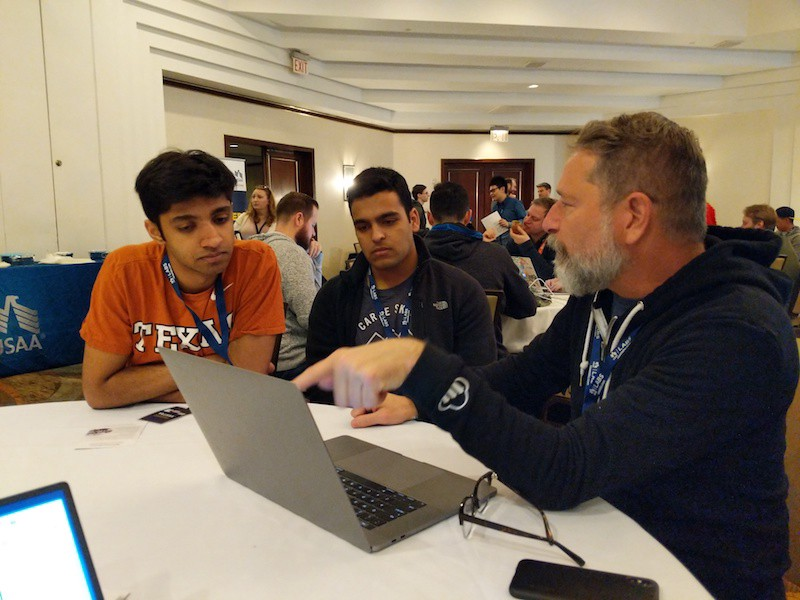
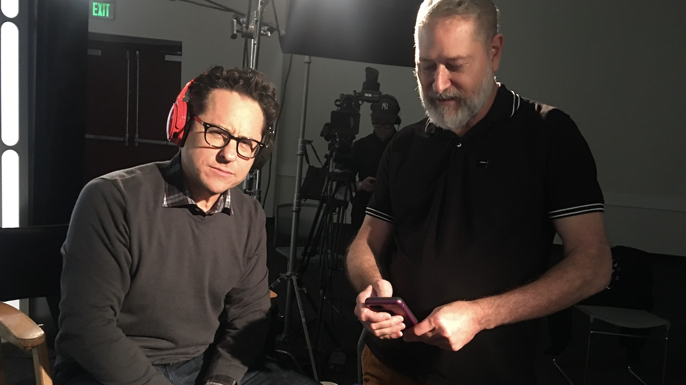

I am a seasoned developer with over three decades of real-world experience in creating, programming, and delivering websites, software, and mobile applications for a diverse range of clients. My portfolio includes projects for commercial brands, non-profits, and corporations, showcasing my ability to adapt to various industries and client needs.

During my time at Dolby, I led a dynamic team in designing and releasing milestone versions of the RTS Unity Publisher and Player plugins. These releases elevated the plugins from basic streaming operations to a whole new level of capabilities, unlocking numerous exciting use cases. Additionally, I had the privilege of developing captivating demo experiences for Dolby.io's activations at events like SXSW, where I showcased technical and customer demos that left a lasting impression on developers.

As an advocate for developer relations, I firmly believe that building strong relationships with developers is the key to success. I strive to be an empathetic listener, amplifying their voices and advocating for their needs within the developer community. Through my practical developer experience, business partnership development, thought leadership, and content creation, I have consistently made a significant impact on the startups I collaborate with.

I have a passion for continuous learning and staying up-to-date with the latest technologies, languages, frameworks, and design patterns. Sharing my knowledge with developers of all levels brings me joy, and I engage with the community through direct interaction, thought leadership, writing, and the creation of compelling content demos.

# Featured Projects and Use Cases:
## Dolby - Unity RTS Plugin/SDK
Successfully led a small agile engineering and product team in designing and releasing versions 1.0 and 1.2 of the RTS Unity Publisher and Player plugins. Dolby’s first Unity Plugin product to go GA. This series of milestone releases takes the plugins from basic streaming operations to a differentiated level of capabilities, enabling a multitude of new use casess

## Demo Experience Lead SXSW (2 Years) 
Successfully developed the demo experience for Dolby.io's developer relations and marketing activations at SXSW. Leading our teams collaborative effort to showcase over 10 technical and customer demos, with attention to details of the experience, the developer messaging and overall expereince. 

## [Build The World Hackathon](https://dolbyio-hackathon-2021.devpost.com/?ref_feature=challenge&ref_medium=discover)
Concieved, developed and manage the program for Dolby's first hackathon. This include developing virtual office hours, sponsorship alliances with Cloudinary and Netlify, the online event drew 505 participants, resulting in 27 validated and complete projects. 

## Bose - Bose AR Platform and SDK
My role focused on creative and technical development of unique experiences for major brand partners including, Disney, LucasFilm, Skywalker Sound, PGA Tour, Microsoft, Capitol Records / Universal Music Group.

## Project: The Bose AR Star Wars Experience
Experience Producer for The Star Wars Bose AR Experience; designed with exclusive content enhanced for Bose AR wearables. The project launched on time, within three months from initial POC to App Store deliverable to almost exact specifications; A centerpiece of a larger brand activation, with interdependent components including product tie-ins, a branded landing page, new analytics, a media campaign, and several launch activities.

Managed audience metrics and accounting for the end-to-end execution of the Star Wars project, outlining improved approaches, crafting, marketing and worked with PR for speaking on behalf of the innovation.

- Multi-milliondar campaign
- 85m+ impressions 
- 30+ minutes average audience engagement
- Webby Award: Best Entertainment App 
- Championed several SDK features and enhancements based on developer feedback.
### Links:
- [Star Wars App Demo](https://vimeo.com/400499649/bd228b1f81)
- [The Star Wars Show](https://www.facebook.com/watch/?v=393671781359981) (Requires Facebook Login)

## Project: Playcrafting Alliance
Bose and Playcrafting teamed up to train developers to make games for the all-new Bose AR. Through this collaboration, hundreds of top-tier developers were trained and created exclusive games for Bose AR. Custom game jams took place in **Boston, New York, San Francisco, Seattle, and San Diego**. Each was the start of development cycles to bring the games to launch on the App Store and Google Play.

- 5 Custom Game Jams
- 30k+ Developers Reached
- 500 SDK Signups
- 211 Developers Trained
- 40 Videos Produced
- 32 Games Released to Apple and Google Play Store
### Links:
[Bose x Playcrafting Alliance](https://www.youtube.com/watch?v=cWiNMmSQLUs)

## Project: UMG / Capitol 360 Lab
BoseAR partnered with Capitol 360 Labs, the official innovation program of Capitol Records and Universal Music. This partnership was dedicated to providing new opportunities for innovation and drive tech forward in the music industry.  Responsible for program development and execution of a series of music industry workshops, events and hackathons.

- 5000 Developers and Music Industry Professionals participated in the event series.
- Colaboration with serveral music artists and influencers
- 1500+ SDK Signups

### Links:
- [Bose and Capitol360 Detroit Code Jam](https://www.youtube.com/watch?v=L7SiIWxtc4U)
- [Capitol 360 Hackathon](https://youtu.be/-Gw95Yh9qNQ)

## Project: SweatWorks / Strava Fitness app - Apple Watch with Bose AR Integration
As advocate and enablement lead; worked with the developement team at *Sweatworks* on a greenfield project to explore, design and develop a next generation fitness experience for the Apple Watch with Bose AR.

- Lead colaboration efforts with Bose AR Engineering team to port the Bose AR iOS SDK to support Apple Watch.
- Developed initial SDK integration
- Developed a preliminary prototype application to demonstrate to our agency partner features of the Bose AR Apple Watch SDK.
- Fostered agency partner's success with out SDK integration by providing clear and consise code sample and best practices for integration of sensor data and spatial audio.
- Solicited developer feedback to improve the SDK. 

### Links:
- [Apple Watch Bose AR SDK Feature Walkthrough and Prototype](https://vimeo.com/410422025/a1a7680b07)

# Thought Leadership, Demos, CodeLabs and Workshops
My primary role as as a developer advocate is to inspire and create sucess for developers using the products, SDKS and APIS of the companies I work with.
This is executed through creative focus and the development of many unique technical demos,blueprint applications, codelabs, workshops and thought leadership writing.

### Thought Leadership
- [Bose.com: Bose AR Partnership for Music Innovation](https://medium.com/@danzeitman/bose-ar-and-capitol-records-partner-to-drive-innovation-in-music-400bc4804a0a) (Bose)
- [Goodbye Channel API, Hello PubNub](https://medium.com/@danzeitman/goodbye-channel-api-hello-pubnub-284f0b749f3e) (PubNub)
- [Magnet for Success](https://devca.mp/ps119sucess-6017a699eb17) (Developer Camp)
- [Hacker Noon](https://hackernoon.com/u/danzeitman)  (Various)
### Conference Talks
- [AWE Munich 2019 - Bose AR Wearables and AI](https://youtu.be/dYfCTavWQxY) (Bose)
- [AI & Machine Learning Summit - Bose AR Framework with Machine Learning](https://youtu.be/unlDICV7r0k) (Bose)
- [VueJS Conf - Lightning talk: Build a MiniFlix Clone with Vue Contest](https://codetalks.tv/talk/build-a-miniflix-clone-with-vue-contest-with-dan-zeitman-a1x5c3ekawu). (Cloudinary)
- [DeveloperWeek San Francisco](https://developerweeksfbayarea2018.sched.com/dan812)  
- [DeveloperWeek NYC](https://developerweekny2018.sched.com/speaker/dan812)  
### Hackaton Guides
- [Capitol Records Hackathon](https://cloudinary.gitbook.io/cil-hackathon-guide/)
### Workshop Tutorials
- [Workshop Introduction to Bose AR  (iOS)](https://bosedevs.gitbook.io/bose-ar-ios-workshop/)
- [Tutorial Spatial Audio (Unity)](https://bosedevs.gitbook.io/spatial-audio-experiences-with-bose-ar/)
### Demos and Blueprint Applications
- [Discover Music (Blueprint)](https://cloudinary.gitbook.io/cil-hackathon-guide/blueprints/discover-music)
- [Discover Music (VueJS)](https://github.com/cloudinary-developers/discover-cmg-music)
- [Music Discovery Service (FAAS - Node)](https://github.com/cloudinary-developers/music-discovery-service)
